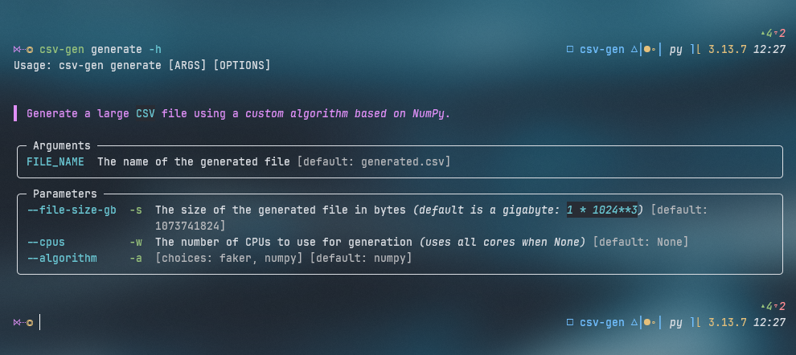
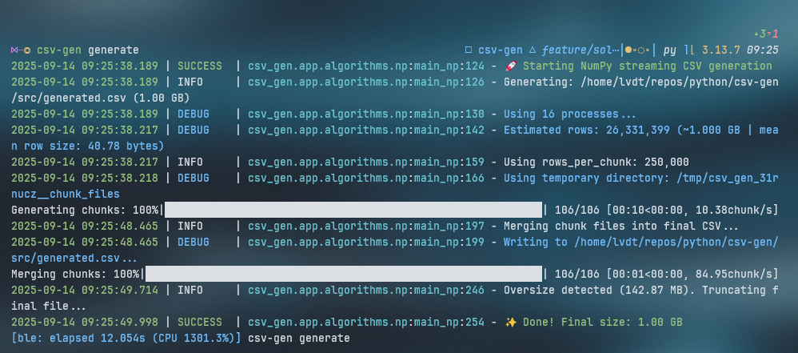

# CSV Gen

CSV Gen is a Python project that provides a command-line interface (`CLI`) to generate large CSV files using two different algorithms:

1. ✅ NumPy based
1. ✅ Faker based
1. ❌ _Pure Python (deprecated)_

## Installation

To install the project, you can use `uv`:

```bash
uv sync --managed-python --all-groups --compile-bytecode
```

## Usage

You can use the following command to generate a large CSV file:

```bash
csv-gen generate -s SIZE_BYTES -w NUM_CPUS -a ALGORITHM [FILENAME]
```

Where:

- `SIZE_BYTES`: The size of the generated file in bytes _(default is a gigabyte: `1 * 1024**3`)_
- `NUM_CPUS`: The number of CPU cores to use for generation _(uses **all** cores when not provided)_
- `ALGORITHM`: The algorithm to use, either `faker` or `numpy` _(default is `numpy`)_
- `[FILENAME]`: The name of the file to generate _(default is `generated.csv`)_

Or simply run the following to display the **help menu**:

```bash
csv-gen generate --help
```

> 

### Examples

#### NumPy

For example, to generate a 25 GB CSV file (`25 * 1024**3 = 26843545600`) called `output.csv`, using 8 CPU cores with the `numpy` algorithm, you can use:

```bash
# The verbose version
csv-gen generate --file-size-gb 26843545600 --cpus 8 output.csv

# Or the short version
csv-gen generate -s 26843545600 -w 8 output.csv
```

To generate a 1 GB CSV file, called `generated.csv`, utilising all available CPU cores (and the `numpy` algorithm), you can simply call the default command:

```bash
csv-gen generate
```

> 

#### Faker

To generate a 50 MB CSV file (`50 * 1024**2 = 52428800`) called `data_faker.csv`, using 6 CPU cores with the `faker` algorithm, you can use:

```bash
# The verbose version
csv-gen generate --file-size-gb 52428800 --cpus 6 --algorithm faker data_faker.csv

# Or the short version
csv-gen generate -s 52428800 -w 6 -a faker data_faker.csv
```

## License

This project is licensed under the terms of the [MIT](LICENSE) license.
